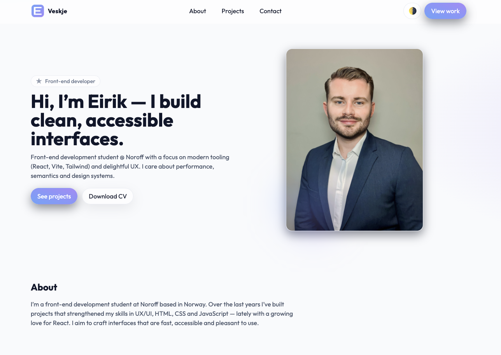

# Portfolio – Eirik Nordstrand Veskje

My personal portfolio website built with **React + Vite + Tailwind**. Clean, accessible, and fast.

[**🌐 Live Site**](https://portfolio-env.netlify.app/) · [GitHub Profile](https://github.com/EVeskje)



---

## ✨ Features

- Modern UI with light/dark mode toggle
- Sticky, accessible header with mobile menu
- Scroll-reveal animations that respect `prefers-reduced-motion`
- Data-driven projects grid (easy to add/update)
- SEO tags + JSON-LD Person schema
- Responsive design and keyboard-friendly navigation

---

## 🧰 Tech Stack

- **React 18** + **Vite**
- **Tailwind CSS**
- Deployed on **Netlify**

---

## 🚀 Getting Started

Follow these steps to run the project locally:

### 1. Clone the repository

```bash
git clone https://github.com/EVeskje/Portfolio.git
cd Portfolio
```

### 2. Install dependencies

```bash
npm install
```

### 3. Run Dev Server

```bash
npm run dev
```

### 4. Build & Preview

```bash
npm run build
npm run preview
```

---

## 🤝 Contributing

Have ideas or suggestions? Feel free to open an issue or a pull request.

---

## 📬 Contact

Made by Eirik Nordstrand Veskje.
For inquiries, reach out via eirik.nv@hotmail.com or LinkedIn [@eirikveskje](https://www.linkedin.com/in/env-link/)
